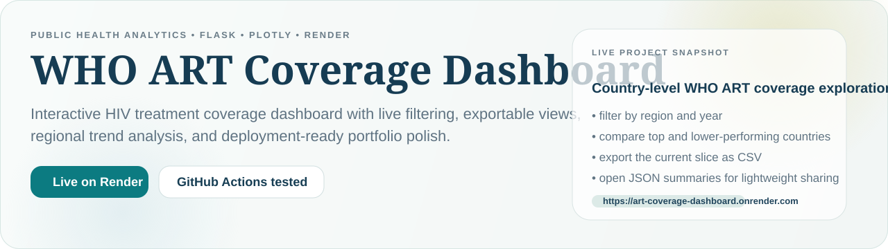
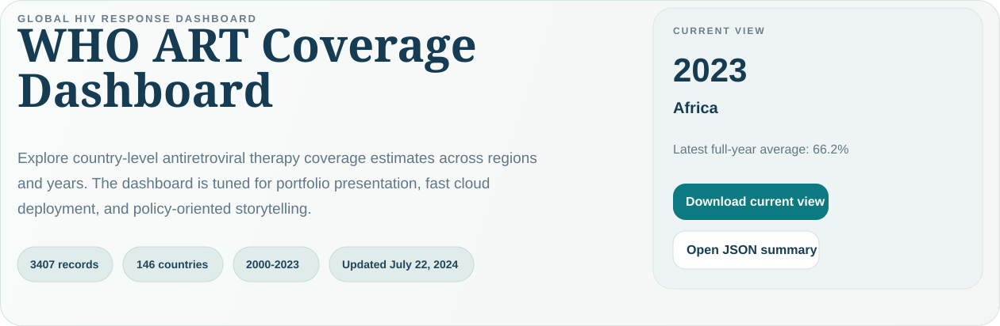
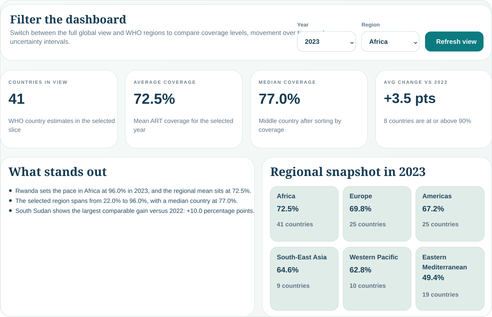
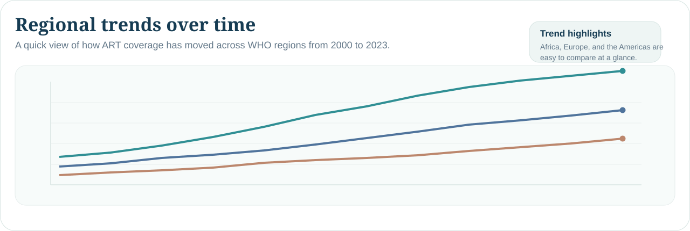

# WHO ART Coverage Dashboard

<p align="center">
  <a href="https://art-coverage-dashboard.onrender.com">
    
  </a>
</p>

[](https://art-coverage-dashboard.onrender.com)
[](https://github.com/andyombogo/art-coverage-app/actions/workflows/python-app.yml)

Interactive Flask dashboard for exploring WHO antiretroviral therapy (ART) coverage estimates by country, region, and year.

## Preview

| Overview | Africa 2023 view |
| --- | --- |
| [](https://art-coverage-dashboard.onrender.com/#dashboard-overview) | [](https://art-coverage-dashboard.onrender.com/?year=2023&region=Africa#filters-and-kpis) |
| Live entry state with quick export actions and deployment-ready framing. | Focused KPI story for a real region/year slice with summary cards and regional context. |

[](https://art-coverage-dashboard.onrender.com/#regional-trends)

Regional trend storytelling that makes the dashboard feel analytical, not just decorative.

## Live demo

- Dashboard: https://art-coverage-dashboard.onrender.com
- JSON summary example: https://art-coverage-dashboard.onrender.com/api/summary?year=2023&region=Africa
- CSV export example: https://art-coverage-dashboard.onrender.com/download/current-view.csv?year=2023&region=Africa

## Why this repo stands out

- Clean Flask + Plotly app designed for lightweight deployment.
- Real WHO country data with region and year filtering.
- Render-ready Blueprint configuration with CI-gated deploys.
- Downloadable filtered CSV views and a lightweight summary API.
- Cleaner repository structure after removing the old generated map artifacts and shapefiles.

## Best way to explore

1. Start with the live dashboard overview to understand the scope and current data freshness.
2. Switch to `2023` and `Africa` to see the strongest KPI story, which matches the highlighted screenshots above.
3. Use the CSV export and JSON summary links when you want a shareable slice of the current view.

## Dashboard features

- Year and region filters for focused exploration.
- Country-level coverage map using ISO-3 country codes from the WHO dataset.
- Regional trend tracking from 2000 to 2023.
- Year-over-year change view for countries with comparable records.
- Tables for highest- and lowest-coverage geographies.
- One-click export of the filtered country view as CSV.
- JSON summary endpoint for lightweight sharing or integration.
- Methodology panel that explains how missing point estimates are handled.

## Local setup

```bash
python -m venv .venv
.venv\Scripts\activate
pip install -r requirements.txt
python app.py
```

Open `http://127.0.0.1:5000/`.

## Deploy on Render

This repo includes `render.yaml` so it can be deployed as a Render Blueprint.

Manual Render settings:

- Build command: `pip install -r requirements.txt`
- Start command: `gunicorn app:app`
- Health check path: `/health`
- Python version: pinned via `.python-version`

Recommended path:

1. In Render, click `New +` -> `Blueprint`.
2. Select `andyombogo/art-coverage-app`.
3. Confirm the imported settings from `render.yaml`.
4. Deploy and wait for `/health` to pass.

Because CI is already in place, the Blueprint is configured to deploy only after checks pass. For a step-by-step checklist, see `docs/render-deploy.md`.

## Project structure

- `app.py`: Flask routes and Render-friendly app entrypoint
- `dashboard/data.py`: data loading and dashboard summaries
- `dashboard/visuals.py`: Plotly figure builders
- `templates/index.html`: dashboard layout
- `static/styles.css`: app styling
- `tests/test_app.py`: regression coverage for routes and data helpers

## Data note

The checked-in source file spans 2000 through 2023 and contains 4,656 WHO rows. After filtering to country observations with usable coverage values, the dashboard works with 3,407 records across 146 countries. When WHO publishes only low and high intervals without a central estimate, the dashboard uses the midpoint for comparative views while still surfacing the original interval in tables and hover states.

## Portfolio tips

- Add `https://art-coverage-dashboard.onrender.com` to the GitHub repo website field.
- Capture screenshots from `#coverage-map`, `#regional-trends`, and `#top-performers`.
- Pin this repo on your GitHub profile once the live link is visible.
- Use `docs/portfolio-copy.md` for a ready-to-paste repo description and pin blurb.


